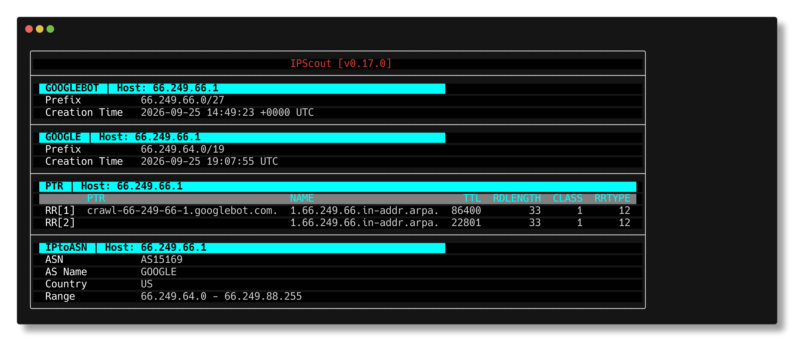

# IPScout

IPScout is a command-line tool for security analysts to enrich IP addresses with their origin and threat ratings.
It queries **103 sources** concurrently — cloud and hosting ranges, CDNs, web crawlers, monitoring probes,
threat feeds and bogon lists — and reports what each one knows about the host.

**94 of the 103 need no configuration at all.** Six ask for an API key (AbuseIPDB, CriminalIP, IPAPI,
IPQualityScore, Shodan and VirusTotal); three more (Annotated, Azure WAF and IPURL) are driven from
your own config.


---

[](https://github.com/jonhadfield/ipscout/actions?query=workflow%3ATest)
[](https://app.codacy.com/gh/jonhadfield/ipscout/dashboard?utm_source=gh&utm_medium=referral&utm_content=&utm_campaign=Badge_grade)
[](https://godoc.org/github.com/jonhadfield/ipscout)

## Table of Contents

- [Features](#features)
- [Output](#output)
- [Providers](#providers)
- [Installation](#installation)
- [Usage](#usage)
- [Configuration](#configuration)
- [Rating](#rating)
- [Provider Details](#provider-details)
- [Changelog](#changelog)
- [License](#license)

## Features

- Query 103 providers concurrently: cloud and hosting ranges, CDNs, crawlers, monitoring probes, threat feeds and bogons
- Score a host with `ipscout rate`: per-provider scores, reasons, and a block or allow recommendation, optionally AI-assisted
- Output as a table, JSON or CSV, in a choice of colour styles
- Cache provider data locally, with per-provider TTLs sized to how often each source publishes
- Manage the cache with `ipscout cache`: list, get, delete, and `gc` to reclaim space
- Inspect configuration with `ipscout config`

## Output
### Format
Results are displayed in a table by default, and can also be emitted as JSON or CSV with the
`--output` flag.

Checking whether a crawler is really Googlebot, using four providers that need no configuration:



- [JSON output](examples/results.json)

### Style
Table styles include ascii (for basic terminals), cyan, red, yellow, green, blue, and can be specified in the `config.yaml` file or with the `--style` flag.

Examples:

- [red](examples/table-red.png)
- [ascii](examples/ascii.txt)

## Providers

IPScout supports multiple well known sources. You can also provide custom sources
with the [Annotated](docs/providers.md#annotated) and [IPURL](docs/providers.md#ipurl) providers.

Provider data and search results can be cached to reduce API calls and improve performance.

| Provider                                                  |     Category     |         Notes         |
|:----------------------------------------------------------|:----------------:|:---------------------:|
| [AbuseIPDB](docs/providers.md#abuseipdb)                                   |  IP Reputation   | Registration required |
| [AhrefsBot](docs/providers.md#ahrefsbot)                                   |   Web crawler    |           -           |
| [AirVPN](docs/providers.md#airvpn) | Anonymiser | - |
| [Akamai](docs/providers.md#akamai)                                         |       CDN        |           -           |
| [Alibaba Cloud](docs/providers.md#alibaba-cloud)                           | Hosting Provider |           -           |
| [Amazonbot](docs/providers.md#amazonbot)                                   |   Web crawler    |           -           |
| [Annotated](docs/providers.md#annotated)                                   |  User Provided   |           -           |
| [Anthropic](docs/providers.md#anthropic)                                   |   Web crawler    |           -           |
| [Apple iCloud Private Relay](docs/providers.md#apple-icloud-private-relay) |    Anonymiser    |           -           |
| [Applebot](docs/providers.md#applebot)                                     |   Web crawler    |           -           |
| [ASN-DROP](docs/providers.md#asn-drop) | Threat Feed | - |
| [Atlassian](docs/providers.md#atlassian)                                   |       SaaS       |           -           |
| [AWS](docs/providers.md#amazon-web-services)                               | Hosting Provider |           -           |
| [Azure](docs/providers.md#azure)                                           | Hosting Provider |           -           |
| [Azure WAF](docs/providers.md#azure-waf)                                   |       WAF        | Azure access required |
| [Better Stack](docs/providers.md#better-stack)                             |    Monitoring    |           -           |
| [Binary Defense](docs/providers.md#binary-defense) | Threat Feed | - |
| [Bingbot](docs/providers.md#bingbot)                                       |   Web crawler    |           -           |
| [Blocklist.de](docs/providers.md#blocklistde)                              |   Threat Feed    |           -           |
| [Bunny CDN](docs/providers.md#bunny-cdn)                                   |       CDN        |           -           |
| [CacheFly](docs/providers.md#cachefly)                                     |       CDN        |           -           |
| [CCBot](docs/providers.md#ccbot)                                           |   Web crawler    |           -           |
| [CDN77](docs/providers.md#cdn77)                                           |       CDN        |           -           |
| [Checkly](docs/providers.md#checkly)                                       |    Monitoring    |           -           |
| [CINS Army List](docs/providers.md#cins-army-list)                         |   Threat Feed    |           -           |
| [CircleCI](docs/providers.md#circleci) | SaaS | - |
| [Cloudflare](docs/providers.md#cloudflare)                                 |       CDN        |           -           |
| [Contabo](docs/providers.md#contabo)                                       | Hosting Provider |           -           |
| [CriminalIP](docs/providers.md#criminalip)                                 |  IP Reputation   | Registration required |
| [Datadog](docs/providers.md#datadog)                                       |       SaaS       |           -           |
| [Detectify](docs/providers.md#detectify)                                   | Vulnerability Scanner |     -     |
| [DigitalOcean](docs/providers.md#digitalocean)                             | Hosting Provider |           -           |
| [DShield](docs/providers.md#dshield)                                       |   Threat Feed    |           -           |
| [DuckDuckBot](docs/providers.md#duckduckbot)                               |   Web crawler    |           -           |
| [Emerging Threats](docs/providers.md#emerging-threats)                     |   Threat Feed    |           -           |
| [Fastly](docs/providers.md#fastly)                                         |       CDN        |           -           |
| [Feodo Tracker](docs/providers.md#feodo-tracker)                           |   Threat Feed    |           -           |
| [Fly.io](docs/providers.md#flyio)                                          | Hosting Provider |           -           |
| [Gcore](docs/providers.md#gcore)                                           |       CDN        |           -           |
| [GCP](docs/providers.md#google-cloud-platform)                             | Hosting Provider |           -           |
| [GitHub](docs/providers.md#github)                                         |       SaaS       |           -           |
| [GitLab](docs/providers.md#gitlab)                                         |       SaaS       |           -           |
| [Google](docs/providers.md#google)                                         | Hosting Provider |           -           |
| [Google Special-case crawlers](docs/providers.md#google-special-crawlers)  |   Web crawler    |           -           |
| [Google User-triggered Fetchers](docs/providers.md#google-user-triggered-fetchers) | Web crawler |         -           |
| [Googlebot](docs/providers.md#googlebot)                                   |   Web crawler    |           -           |
| [Grafana](docs/providers.md#grafana)                                       |    Monitoring    |           -           |
| [GreenSnow](docs/providers.md#greensnow)                                   |   Threat Feed    |           -           |
| [HetrixTools](docs/providers.md#hetrixtools) | Monitoring | - |
| [Hetzner](docs/providers.md#hetzner)                                       | Hosting Provider |           -           |
| [Huawei Cloud](docs/providers.md#huawei-cloud)                             | Hosting Provider |           -           |
| [IBM Cloud](docs/providers.md#ibm-cloud)                                   | Hosting Provider |           -           |
| [Imperva](docs/providers.md#imperva)                                       |       WAF        |           -           |
| [Intercom](docs/providers.md#intercom)                                     |       SaaS       |           -           |
| [InternetDB](docs/providers.md#internetdb)                                 | Scan Data        |           -           |
| [ip-api.com](docs/providers.md#ip-apicom)                                  |  IP Geolocation  |           -           |
| [IPAPI](docs/providers.md#ipapi)                                           |  IP Geolocation  | Registration required |
| [IPQualityScore](docs/providers.md#ipqualityscore)                         |  IP Reputation   | Registration required |
| [IPsum](docs/providers.md#ipsum) | Threat Feed | - |
| [IPtoASN](docs/providers.md#iptoasn)                                       |     ASN Data     |           -           |
| [IPURL](docs/providers.md#ipurl)                                           |  User Provided   |           -           |
| [IVPN](docs/providers.md#ivpn) | Anonymiser | - |
| [Leaseweb](docs/providers.md#leaseweb)                                     | Hosting Provider |           -           |
| [Linode](docs/providers.md#linode)                                         | Hosting Provider |           -           |
| [M247](docs/providers.md#m247)                                             | Hosting Provider |           -           |
| [Microsoft 365](docs/providers.md#microsoft-365)                           |       SaaS       |           -           |
| [Mullvad](docs/providers.md#mullvad)                                       |   Anonymiser     |           -           |
| [New Relic](docs/providers.md#new-relic)                                   |    Monitoring    |           -           |
| [NodePing](docs/providers.md#nodeping) | Monitoring | - |
| [Okta](docs/providers.md#okta)                                             |       SaaS       |           -           |
| [OpenAI](docs/providers.md#openai)                                         |   Web crawler    |           -           |
| [Oracle Cloud (OCI)](docs/providers.md#oracle-cloud-oci)                   | Hosting Provider |           -           |
| [OVH](docs/providers.md#ovh)                                               | Hosting Provider |           -           |
| [PerplexityBot](docs/providers.md#perplexitybot)                           |   Web crawler    |           -           |
| [Pingdom](docs/providers.md#pingdom)                                       |    Monitoring    |           -           |
| [PTR](docs/providers.md#ptr)                                               |       DNS        |           -           |
| [Qualys](docs/providers.md#qualys) | Vulnerability Scanner | - |
| [QUIC.cloud](docs/providers.md#quiccloud) | CDN | - |
| [Render](docs/providers.md#render)                                         | Hosting Provider |           -           |
| [Salesforce](docs/providers.md#salesforce)                                 |       SaaS       |           -           |
| [Scaleway](docs/providers.md#scaleway)                                     | Hosting Provider |           -           |
| [Sentry](docs/providers.md#sentry)                                         |    Monitoring    |           -           |
| [Shodan](docs/providers.md#shodan)                                         |  IP Reputation   | Registration required |
| [Site24x7](docs/providers.md#site24x7)                                     |    Monitoring    |           -           |
| [Spamhaus DROP](docs/providers.md#spamhaus-drop)                           |   Threat Feed    |           -           |
| [StatusCake](docs/providers.md#statuscake)                                 |    Monitoring    |           -           |
| [StopForumSpam](docs/providers.md#stopforumspam) | Threat Feed | - |
| [Stripe](docs/providers.md#stripe)                                         |       SaaS       |           -           |
| [Surfshark](docs/providers.md#surfshark) | Anonymiser | - |
| [Team Cymru Bogons](docs/providers.md#team-cymru-bogons)                   |      Bogon       |           -           |
| [Telegram](docs/providers.md#telegram) | SaaS | - |
| [Tenable](docs/providers.md#tenable)                                       | Vulnerability Scanner |     -     |
| [Tencent Cloud](docs/providers.md#tencent-cloud)                           | Hosting Provider |           -           |
| [ThreatFox](docs/providers.md#threatfox) | Threat Feed | - |
| [Tor Exit Node](docs/providers.md#tor-exit-node)                           |   Anonymiser     |           -           |
| [updown.io](docs/providers.md#updownio)                                    |    Monitoring    |           -           |
| [UptimeRobot](docs/providers.md#uptimerobot)                               |    Monitoring    |           -           |
| [Uptrends](docs/providers.md#uptrends)                                     |    Monitoring    |           -           |
| [VirusTotal](docs/providers.md#virustotal)                                 |  IP Reputation   | Registration required |
| [Vultr](docs/providers.md#vultr)                                           | Hosting Provider |           -           |
| [X4BNet](docs/providers.md#x4bnet) | Threat Feed | - |
| [Zoom](docs/providers.md#zoom)                                             |       SaaS       |           -           |
| [Zscaler](docs/providers.md#zscaler)                                       |    Security      |           -           |

## Installation

Binaries for macOS, Linux and Windows are available on the [releases](https://github.com/jonhadfield/ipscout/releases)
page.

### macOS - Homebrew

```
$ brew install --cask jonhadfield/ipscout/ipscout
```

Naming the cask in full is deliberate. Homebrew now refuses to load formulae and casks
from taps you have not trusted, so tapping first and installing by short name fails:

```
$ brew tap jonhadfield/ipscout
$ brew install ipscout
Error: Refusing to load cask jonhadfield/ipscout/ipscout from untrusted tap jonhadfield/ipscout.
```

Asking for the cask by its fully qualified name is treated as trusting that one cask, so
the single command above works with no extra step. If you prefer to tap first, trust the
tap once:

```
$ brew tap jonhadfield/ipscout
$ brew trust --tap jonhadfield/ipscout
$ brew install ipscout
```

Upgrades work normally either way, with `brew upgrade --cask ipscout`.

Since 0.6.2, ipscout is distributed as a Homebrew cask. If you installed an earlier
version (distributed as a formula), reinstall once to migrate:

```
$ brew uninstall ipscout
$ brew install --cask jonhadfield/ipscout/ipscout
```

### Install script (Linux and macOS)
Install latest release.
```shell
curl -sL https://raw.githubusercontent.com/jonhadfield/ipscout/main/install | sh
```

On macOS the Homebrew cask above is the better route, since it handles upgrades and clears the
quarantine attribute for you. The script is there for Linux, and for a macOS machine without
Homebrew.

This works out the latest release, downloads the archive for the machine it is run on, checks it
against `checksums.txt` published beside it, and installs to `/usr/local/bin`. The directory is
created if it is not there, and `sudo` is used only if it cannot be written to otherwise. A download
that does not match its checksum is refused, and nothing is installed.

Three optional variables:

| variable | what it does |
| --- | --- |
| `IPSCOUT_VERSION` | a tag to install, e.g. `0.12.1`. Default: the latest release |
| `IPSCOUT_INSTALL_DIR` | where to put the binary. Default: `/usr/local/bin` |
| `GITHUB_URL` | for a mirror or an enterprise host |

```shell
curl -sL https://raw.githubusercontent.com/jonhadfield/ipscout/main/install | IPSCOUT_INSTALL_DIR=~/.local/bin sh
```

The variable goes on the `sh` at the end of the pipe, not on the `curl` at the front, which would set
it for the download instead of for the script.

### Other distributions

Download the latest release from the [releases](https://github.com/jonhadfield/ipscout/releases) page.

### Docker

Images are published to the GitHub Container Registry for each release, for
`linux/amd64` and `linux/arm64`:

```shell
docker run --rm ghcr.io/jonhadfield/ipscout:latest 1.1.1.1
```

A tag pins a version: `ghcr.io/jonhadfield/ipscout:0.16.1`.

The image runs as a non-root user and holds only the binary, so it has no
config or cache of its own. Mount yours to use it, and to keep the provider
cache between runs:

```shell
docker run --rm -v "$HOME/.config/ipscout:/home/nonroot/.config/ipscout" ghcr.io/jonhadfield/ipscout:latest 1.1.1.1
```

API keys are read from the environment, so pass them with `-e`:

```shell
docker run --rm -e SHODAN_API_KEY -v "$HOME/.config/ipscout:/home/nonroot/.config/ipscout" ghcr.io/jonhadfield/ipscout:latest 1.1.1.1
```

The mount covers the cache as well, as ipscout keeps it in
`.config/ipscout/cache`, so repeated lookups reuse provider data instead of
downloading it again.

### Build from source

Go 1.27 or later is required to compile ipscout. Clone the repository and run:

```shell
go build ./...
```

This will create an `ipscout` binary in the current directory.

Releasing ipscout and keeping the ip-fetcher dependency current are documented for
maintainers in [AGENTS.md](AGENTS.md).

## Usage

```shell
$ ipscout <host>
```
`<host>` can be an IP address or a fully qualified domain name.

The same commands work in a container, see [Docker](#docker):

```shell
$ docker run --rm ghcr.io/jonhadfield/ipscout:latest <host>
```

Additional commands are available:

```shell
$ ipscout cache    # manage cached results
$ ipscout config   # view or output configuration
$ ipscout rate     # rate a host using provider data
```

## Configuration

A default configuration is created
on first run and located at: `$HOME/.config/ipscout/config.yaml`.

Some configuration can be overridden on the command line, see `ipscout --help`.

```yaml
---
global:
  indent_spaces: 2      # number of spaces to indent output
  max_value_chars: 300  # limit the number of characters output in results
  max_age: 90d          # maximum age of reports to consider
  max_reports: 5        # maximum number of reports to display
  ports: ["443/tcp"]    # filter results by port [tcp,udp,443/tcp,...]
  output: table         # output format: table or json
  style: cyan           # output style [ascii, cyan, green, yellow, red, blue]

providers:
# list of providers with their configurations below...
```

Providers that need no configuration are added to an existing config file, enabled, when a
new release introduces them. A provider you have disabled is left disabled.

Providers that need an API key (AbuseIPDB, Criminal IP, IPAPI, IPQualityScore, Shodan and
VirusTotal) are disabled in the default config. To use one, set its API key and set
`enabled: true`. A keyed provider that is enabled without a key is reported as an error.
Config files written before `global.config_version` existed are updated once to disable
keyed providers that have no key.

When few providers return data for a host, IPScout suggests, at most once a day, API keys
that would add more. Set `global.disable_tips: true` to turn this off. The TUI shows these
tips, errors and warnings in its footer.

## Rating

`ipscout rate` combines the results from every provider that supports rating into a single
score and a block or allow recommendation.

```shell
$ ipscout rate 1.10.16.1
```

```
+------------+----------+-------+-----------------------------------------------------------+
| PROVIDER   | DETECTED | SCORE | REASONS                                                   |
+------------+----------+-------+-----------------------------------------------------------+
| spamhaus   | true     | 10.00 | listed on Spamhaus DROP (do not route or peer): SBL256894 |
| abuseipdb  | true     | 3.00  | confidence: 0.00                                          |
| ipqs       | true     | 9.00  | confidence: 0.00                                          |
| virustotal | true     | 0.00  | harmless                                                  |
+------------+----------+-------+-----------------------------------------------------------+
| AVERAGE    |          | 5.50  |                                                           |
+------------+----------+-------+-----------------------------------------------------------+
Recommendation: block
```

Each provider that matches the host contributes a score. The scores are averaged, and the
result is compared against `blockScoreThreshold`: below it the recommendation is `allow`,
otherwise `block`. A provider reporting a `noblock` threat indicator, such as an entry
annotated that way in your own data, forces `allow` regardless of the score.

### Rating configuration

No setup is required. If no rating configuration file exists, the built-in defaults are
used and the path checked is reported so you know where to put one.

To write your own, start from the defaults:

```shell
$ ipscout rate config --default > $HOME/.config/ratingConfig.json
```

The location is set by `rating.config_path` in `config.yaml`, and `<home>` in that value is
expanded to your home directory:

```yaml
rating:
  config_path: <home>/.config/ratingConfig.json
  use_ai: false
  openai_api_key: <your-openai-api-key>
```

`ipscout rate config` prints your rating configuration file, and `--path` prints one from a
specific location. Both validate what they read, so they are a way to check a file parses.
Unlike rating itself, they require the file to exist rather than falling back to the
defaults.

The configuration has a global section and a per-provider section, abbreviated here (the
shipped defaults list 26 high threat country codes and carry an entry for 50 providers):

```json
{
  "global": {
    "blockScoreThreshold": 5.0,
    "highThreatCountryCodes": ["CN", "RU", "IR"],
    "mediumThreatCountryCodes": ["NL", "CA"]
  },
  "providers": {
    "spamhaus": { "defaultMatchScore": 10.0 },
    "aws": { "defaultMatchScore": 7.0 },
    "shodan": {
      "openPortsScore": 5.0,
      "highThreatCountryMatchScore": 10.0,
      "mediumThreatCountryMatchScore": 7.0
    }
  }
}
```

Most providers take a single `defaultMatchScore`, applied when the host matches their data.
Threat feeds default to 10.0 and hosting providers to 7.0-8.0, so appearing on a blocklist
weighs more than merely being hosted somewhere. CriminalIP, Shodan and VirusTotal take
finer-grained scores for the specific conditions they report.

### AI rating

With `--ai`, the threat indicators each provider reports are shown and then sent to OpenAI,
which returns a written assessment in place of the scored table:

```shell
$ ipscout rate --ai 1.10.16.1
```

This requires an OpenAI API key, set with `--openai-api-key` or `rating.openai_api_key` in
`config.yaml`.

## Provider Details

Each provider, what it holds and how to configure it, is documented in
[docs/providers.md](docs/providers.md).

## Changelog

See [CHANGELOG.md](docs/CHANGELOG.md) for release notes.

## License

IPScout is licensed under the [Apache 2.0 License](LICENSE).
